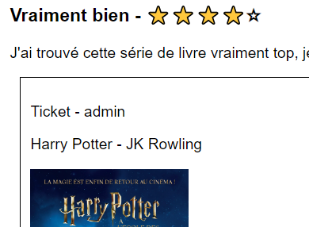

# LITREVIEW

## About

- LitReview is a web application that allows users to request and post book or article reviews. 
- Users can create posts to request/ask for a review, read reviews from users they follow, and publish their own reviews.

## Features

- Tickets: Users can create Tickets to request reviews for books or articles.
- Reviews: Users can post reviews in response to tickets.
- Combined Post Creation: Users can create a ticket and a review for that ticket simultaneously.
- Feed: The feed displays tickets and reviews from users the logged-in user follows, as well as their own content.
- Following Users: Users can follow other users to see their reviews and tickets
- Authentication: The site provides registration and login pages.

## Usage

## Context - Develop an Web Application using Django

- First time using Django, I found this tool particularly useful and effective for managing a website and its database
- The LitReview application is built using the Django framework and SQLite as the local database. 
- It adheres to the PEP8 guidelines for Python code.

## Skills

- Django Framework
- SQLite Database
- Front-end Development (Wireframes provided)
- PEP8 Guidelines

## Credits
[Tuxiboule](https://github.com/Tuxiboule)